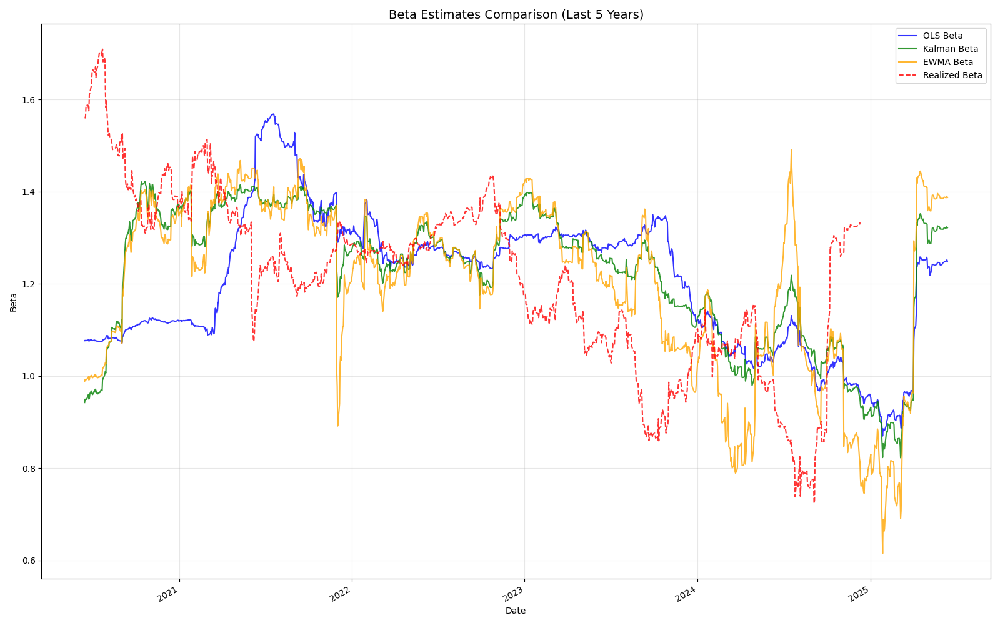

## Beta Estimation

The idea of this project is to compare beta calculation methods based on this [paper](https://papers.ssrn.com/sol3/papers.cfm?abstract_id=2538365). The main idea behind the project is the idea that basic beta calculation may be completely off of the "true" values. This may lead to large faults in hedge sizing, for example for a portfolio of \$1 billion a difference of 0.1 in beta is already a \$100 million hedge amount difference.

### 1 - Rolling OLS Regression

Standard 252-day regression treating all observations equally. The logic is simple - use enough history to get statistically significant estimates while being recent enough to capture current regime. The equal weighting assumption is both its strength (stable, less prone to noise) and weakness (slow to adapt to structural changes). Works best when beta is genuinely stable over the estimation window.

### 2 - Kalman Filter

Treats beta as a latent state variable evolving according to a random walk with Gaussian noise. The measurement equation is the standard CAPM relationship (stock return = alpha + beta * market return + noise), while the state equation assumes beta follows a random walk $\beta_t = \beta_{t-1} + \text{process noise}$.

The key insight is that recent observations should get higher weight, but the optimal weighting depends on the signal-to-noise ratio. I set both process and observation variance to 1e-2, following Hollstein & Prokopczuk. When beta is changing rapidly (high process variance relative to observation variance), the filter adapts quickly. When beta is stable (low process variance), it behaves more like a long-term average. The math automatically balances between responsiveness and stability based on the underlying data patterns.

### 3 - EWMA Beta

Applies exponential decay weighting where yesterday's return gets 98% the weight of today's. The 0.98 decay means you're effectively using about 50 days of data (1/(1-0.98)), but recent observations dominate. The weights decay as 0.98^t, so observations from 30 days ago get roughly 55% the weight of today's observation.

Unlike Kalman, the weighting scheme is fixed rather than adaptive - it doesn't adjust based on whether beta appears to be changing. This makes it more responsive to recent patterns but also more susceptible to temporary noise. Works well when recent regime changes are persistent but can be overly reactive to temporary volatility spikes.

### 4 - Realized Beta

Forward-looking calculation using the subsequent 126 trading days. This isn't predictive - it's the ground truth we're trying to forecast. Calculated as the covariance of forward stock returns with forward market returns divided by forward market variance. The 126-day window roughly matches one earnings cycle, capturing medium-term systematic risk relationships while avoiding the noise of shorter windows.

### Results



The RMSE values comparing each method against forward-realized beta:
```
OLS RMSE: 0.386
Kalman RMSE: 0.381  
EWMA RMSE: 0.435
Realized RMSE: 0.000 (baseline)
```

Kalman filter performed best, with the lowest prediction error against what actually happened over the subsequent 126 days. The 1.3% advantage over OLS isn't massive, but it's meaningful - especially when you consider this is on a single name over a specific period.

EWMA performed worst, with prediction errors roughly 14% higher than Kalman. This suggests that whatever recent beta patterns EWMA was detecting didn't persist into the forward period. The exponential weighting scheme was essentially chasing noise rather than signal.

OLS came in second, performing nearly as well as Kalman. This makes sense if AAPL's beta was relatively stable during this period - the Kalman filter's adaptive weighting didn't provide much advantage over the simple equal-weighted approach, but enough to edge it out.

### Further Work

The current setup evaluates estimation approaches on a single name. Scaling to a full universe would reveal whether the methodological differences have portfolio-level significance. More importantly, you'd want to test whether the estimation accuracy translates to better risk management or alpha generation in practice.