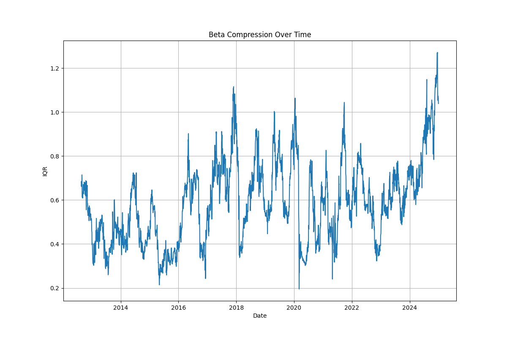

# Beta Compression

The idea for this project came from Advanced Portfolio Management in which Gappy created the same IQR based on [Betting against beta]() which found that it can be used as a gauge of risk appetite in the market.

The idea itself is just that we estimate the daily beta for a basket of stocks and then take the difference between the 75th percentile and the 25th percentile on each day.  

### Beta Compression Calculation

### Beta Compression as a Signal

### Improvements

For the beta compression calculation the most obvious improvement would be to use the whole universe of SP500 stocks and backdate them as well.