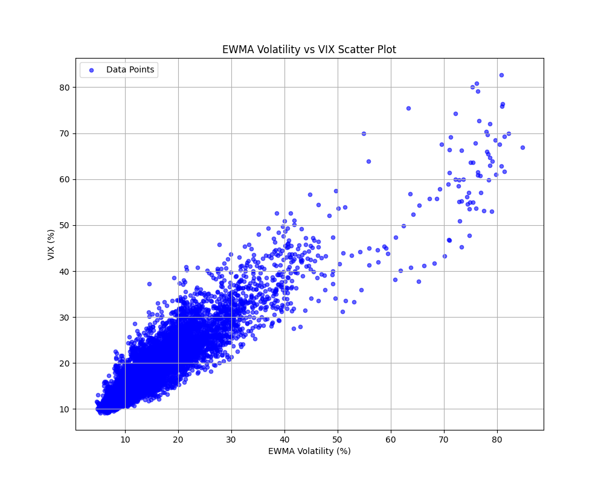

# Calculating Volatility

As anyone who has read an Euan Sinclair book knows there are at least six different ways of calculating volatility. 

In this image we can see the six ways ranging from the basic close-to-close volatility to the Yang-Zhang volatility of the S&P500 futures. I have also plotted the volatility index (VIX). 


The reason that I have also plotted the VIX is because I was interested in seeing which of the methods most closely comes to the values of the VIX and perhaps one of them could be used as a rudimentary proxy.

```
  Volatility_Measure  MSE   RMSE   MAPE   MAE    R²  Correlation  P_Value  
               EWMA  26.64  26.64  22.64  4.24  0.59         0.91      0.0   
         Yang-Zhang  30.48  30.48  23.97  4.49  0.53         0.90      0.0   
     Close-to-Close  37.23  37.23  26.00  4.90  0.43         0.87      0.0   
    Rogers-Satchell  49.43  49.43  33.70  6.27  0.24         0.90      0.0   
       Garman-Klass  49.79  49.79  33.83  6.30  0.24         0.90      0.0   
          Parkinson  50.38  50.38  33.84  6.31  0.23         0.90      0.0 
```



After running a linear regression 

This is a very basic project but some uses could be:
- Applying this to assets where a VIX does not exist.
- Backtesting strategies pre 1990.
- Risk model input.