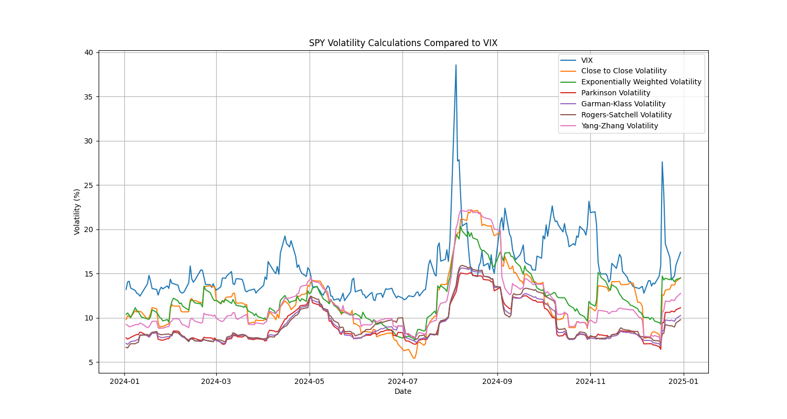

# Calculating Volatility

As anyone who has read an Euan Sinclair book knows there are at least six different ways of calculating volatility. 

In this image we can see the six ways ranging from the basic close-to-close volatility to the Yang-Zhang volatility of the S&P500 futures. I have also plotted the volatility index (VIX). 

The reason that I have also plotted the VIX is because I was interested in seeing which of the methods most closely comes to the values of the VIX.