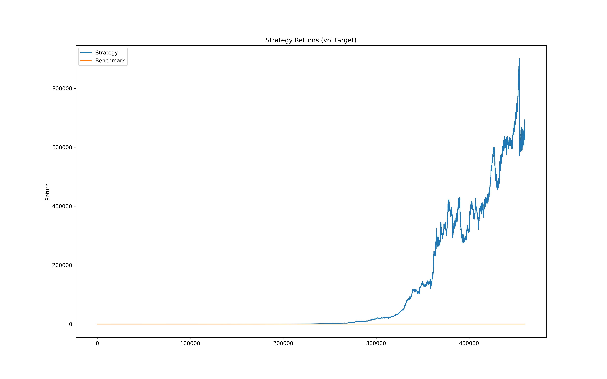

## Equities Returns Prediction
I know it is called EQUITIES returns prediction, but getting a LOT of intraday data for crypto is free whereas getting the same data for equities is not, but the general concept can still be applied.

For now as we can see the stonk goes up. I still need to implement trade sizing with vol targeting and all the fee adjustments.
