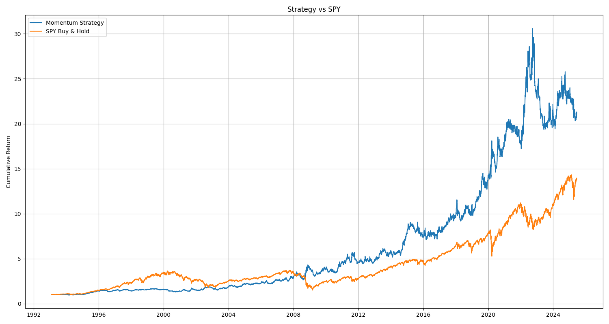
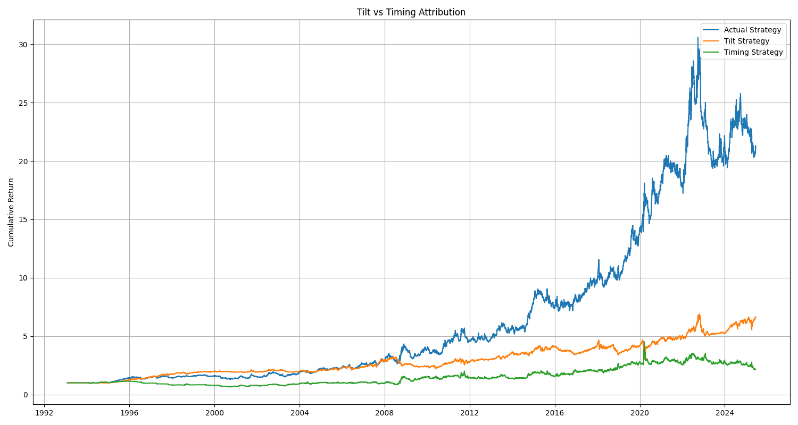

## Multi-Asset Momentum Strategy

This strategy implements a systematic time series momentum approach across four major asset classes (equities, bonds, commodities, currencies) based on [this](https://threadreaderapp.com/thread/1587591552691765251.html) twitter thread and the Time series momentum [paper](https://www.sciencedirect.com/science/article/pii/S0304405X11002613).   

### 1 - Multi-Timeframe Trend

The momentum signal consists of three distinct time horizons:

- Fast (1-month): Captures short-term market momentum and recent price movements
- Medium (3-month): Identifies intermediate trends, historically the most persistent
- Slow (12-month): Captures longer-term directional moves while avoiding very long-term reversals

The strategy combines these three timeframes because trends happen at different speeds. A stock might be in a short-term dip but still part of a longer-term uptrend.  

### 2 - Position Sizing

Positions are inversely scaled by ex-ante volatility forecasts (combination of 30-day and 252-day realized volatility) to achieve equal risk contribution across assets.

Without vol-scaling, high-volatility assets would dominate portfolio risk, reducing diversification benefits.

### 3 - Risk Management

Portfolio volatility targeting tries to keep things steady while buffers prevent constant tweaking (which also decreases transaction costs). Finally maximum position sizing stops any one position from becoming too large and killing the entire portfolio.

### 4 - Portfolio Risk Targeting
Dynamic risk scaling targets 15% annualized volatility using a 60-day lookback, with scaling factors clamped between 0.5x-2.0x.
Performance Results

Period: Max available data for each ETF (varies by instrument)

- Total Return: 2,008%
- Annualized Return: 11.21%
- Annual Volatility: 18.85%
- Sharpe Ratio: 0.59
- Maximum Drawdown: -36.7%

### 5 - Performance



Now to look at an attribution method that I saw on [@quantymacro](https://x.com/quantymacro)'s blog which came from [@macrocephalopod](https://x.com/macrocephalopod). The idea is to create a tilt strategy using rolling 1-year average positions for each asset, capturing the structural/directional bias of the strategy and a timing strategy where the residual between actual positions and tilt positions, capturing tactical moves around average positioning. 



```angular2html
Actual Strategy Sharpe:    0.59
Tilt Strategy Sharpe:      0.52
Timing Strategy Sharpe:    0.22
```

### 6 - What Went Wrong/Could Be Improved

The -36.7% maximum drawdown suggests the risk targeting mechanism was insufficient during stress periods. The 60-day lookback may be too slow to react to regime changes, and the 0.5x minimum scaling factor may be too high. This could be improved by implementing faster volatility estimators (e.g., GARCH models).

Risk control could be improved further by introducing:
- Correlation regime detection: Reduce leverage when cross-asset correlations spike
- Drawdown controls: Dynamic position sizing based on strategy drawdown
- Sector momentum constraints: Prevent over-concentration in trending sectors