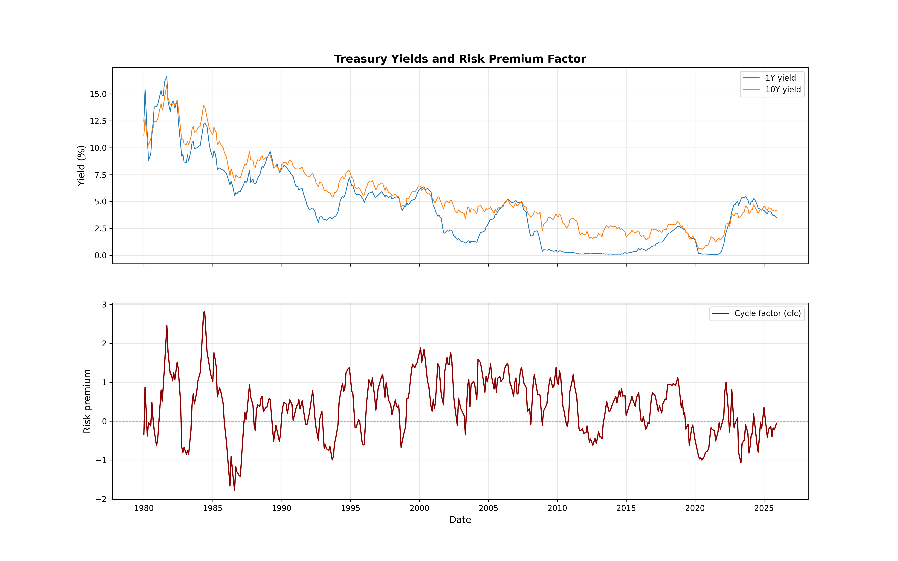

## Expected Returns in Treasury Bonds

A python implementation of "Expected Returns in Treasury Bonds". The key insight being that Treasury yields can be decomposed into a slow-moving trend and a stationary cycle component.

Trend inflation is constructed using exponential smoothing of year-over-year CPI inflation

Cycles are defined as deviations of yields from their trend-driven component.

$$y_n(t) = a_n + b_n \cdot \tau_t + c_n(t)$$

where $c_n(t)$ is the cycle for maturity $n$. We regress yields on trend inflation and take residuals.

The forecasting factor combines the short-rate cycle and duration-weighted average cycle.

$$\bar{c}_t = \frac{1}{3} \left[ \frac{c_2(t)}{2} + \frac{c_5(t)}{5} + \frac{c_{10}(t)}{10} \right]$$

$$cfc_t = \gamma_0 + \gamma_1 \cdot c_1(t) + \gamma_2 \cdot \bar{c}_t$$

Coefficients $\gamma$ are estimated by regressing average excess returns on $c_1$ and $\bar{c}$.

One-year holding period excess returns are estimated using the linearized approximation.

$$rx_n(t+12) \approx -(n-1) \cdot y_{n-1}(t+12) + n \cdot y_n(t) - y_1(t)$$

Newey-West (HAC) standard errors with 18 lags to account for overlapping annual returns.

**Unrestricted:** Each maturity predicted by $c_1$ and $\bar{c}$ separately

$$rx_n(t+12) = a_n + b_{1,n} \cdot c_1(t) + b_{2,n} \cdot \bar{c}(t) + \varepsilon_{n,t+12}$$

**Restricted:** Single $cfc$ factor predicts all maturities

$$rx_n(t+12) = a_n + b_n \cdot cfc_t + \varepsilon_{n,t+12}$$

## Results



```
rx_2: β=1.504, R²=0.327
rx_5: β=5.727, R²=0.473
rx_10: β=11.231, R²=0.469
```

**Note:** I used FRED DGS yields instead of Fama-Bliss zero-coupon bond data or GSW zero-coupon yields because they are free.