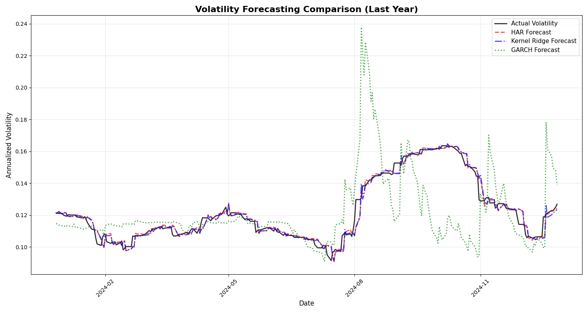

## Volatility Calculation and Forecasting Methods

This project implements and compares three volatility forecasting approaches for equity market volatility: the Heterogeneous Autoregressive model (HAR-RV), Kernel Ridge Regression, and traditional GARCH models. 

### Volatility Measurement

Since the papers use different models for calculating volatility I will be using the following formula for ease of comparison.
$$RV_t = |r_t| * \sqrt{252}$$

This design choice follows LeBaron (2018), which found that absolute returns provide more robust estimates than squared returns, especially in the presence of microstructure noise and outliers.

### 1 - HAR-RV

Based on Corsi (2009)'s heterogeneous market hypothesis:

$$RV_{t+1} = β₀ + β₁·RV_t^{(daily)} + β₂·RV_t^{(weekly)} + β₃·RV_t^{(monthly)} + ε_{t+1}$$

### 2 - Kernel Ridge Regression (Nonlinear Extension)

Following LeBaron (2018), I augment the HAR features with lagged returns and apply RBF kernels:

Features: 
- HAR lags + previous day's return
- Kernel: Radial Basis Function (γ=0.05)
- Regularization: L2 penalty (α=0.1)

### 3 - GARCH(1,1) (Traditional Benchmark)

I include the industry-standard GARCH(1,1) model as a baseline:

$$\sigma^2_t=\omega+\alpha\epsilon^2_{t-1}+\beta\sigma^2_{t-1}$$

This serves as a natural benchmark given its widespread adoption in risk management and its theoretical foundation in the conditional heteroskedasticity literature.

### Results



```
Model             MSE          R²         MAE         RMSE
HAR             0.000050    0.994802    0.003414    0.007094
Kernel Ridge    0.000098    0.989877    0.003648    0.009899
GARCH           0.007648    0.209912    0.040828    0.087453
```

The linear HAR model substantially outperforms both nonlinear and traditional approaches, achieving nearly 29% explanatory power for volatility dynamic

```
               HAR      Kernel Ridge   GARCH
HAR           1.0000        0.9977     0.6473
Kernel Ridge  0.9977        1.0000     0.6303
GARCH         0.6473        0.6303     1.0000
```

HAR and Kernel Ridge produce moderately correlated forecasts (73.5%), suggesting they capture similar underlying patterns, but HAR does so more efficiently. Both models show low correlation with GARCH (≈20%), indicating fundamentally different approaches to volatility modeling.