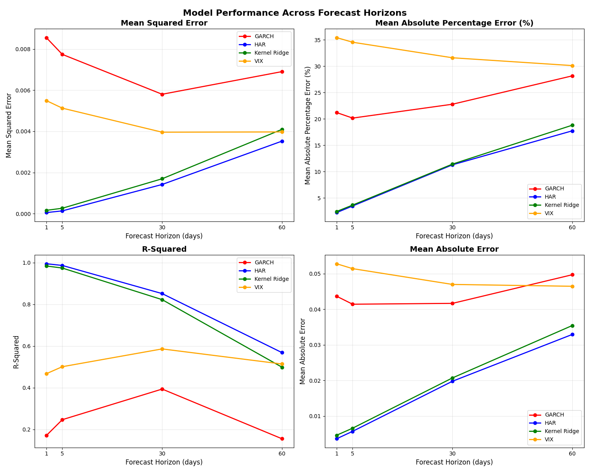

## Volatility Calculation and Forecasting Methods

This project implements and compares four volatility forecasting approaches for equity market volatility across multiple forecast horizons: the Heterogeneous Autoregressive model (HAR-RV), Kernel Ridge Regression, traditional GARCH models, and VIX as a market-based baseline.


### Volatility Measurement

Since the papers use different models for calculating volatility I will be using the following formula for ease of comparison.
$$RV_t = |r_t| * \sqrt{252}$$

This design choice follows LeBaron (2018), which found that absolute returns provide more robust estimates than squared returns, especially in the presence of microstructure noise and outliers.

### 1 - HAR-RV

Based on Corsi (2009)'s heterogeneous market hypothesis:

$$RV_{t+1} = β₀ + β₁·RV_t^{(daily)} + β₂·RV_t^{(weekly)} + β₃·RV_t^{(monthly)} + ε_{t+1}$$

### 2 - Kernel Ridge Regression (Nonlinear Extension)

Following LeBaron (2018), I augment the HAR features with lagged returns and apply RBF kernels:

Features: 
- HAR lags + previous day's return
- Kernel: Radial Basis Function (γ=0.05)
- Regularization: L2 penalty (α=0.1)

### 3 - GARCH(1,1) (Traditional Benchmark)

I include the industry-standard GARCH(1,1) model as a baseline:

$$\sigma^2_t=\omega+\alpha\epsilon^2_{t-1}+\beta\sigma^2_{t-1}$$

This serves as a natural benchmark given its widespread adoption in risk management and its theoretical foundation in the conditional heteroskedasticity literature.

### 4 - VIX (Market-Based Baseline)

The VIX index serves as a market-based volatility forecast, representing the market's expectation of 30-day volatility implied by S&P 500 index options.

### Multi-Horizon Forecast Results

The models are evaluated across four forecast horizons: 1-day, 5-day, 30-day, and 60-day forecasts.



#### 1-Day Forecast Results
```
Model           MSE          R²         MAE         MAPE
HAR            0.0001      0.9948      0.0036      2.22%
Kernel Ridge   0.0002      0.9842      0.0046      2.43%
GARCH          0.0086      0.1703      0.0437     21.20%
VIX            0.0055      0.4670      0.0528     35.42%
```

#### 5-Day Forecast Results
```
Model           MSE          R²         MAE         MAPE
HAR            0.0001      0.9867      0.0057      3.47%
Kernel Ridge   0.0003      0.9742      0.0066      3.64%
GARCH          0.0077      0.2464      0.0414     20.15%
VIX            0.0051      0.5007      0.0514     34.54%
```

#### 30-Day Forecast Results
```
Model           MSE          R²         MAE         MAPE
HAR            0.0014      0.8516      0.0198     11.29%
Kernel Ridge   0.0017      0.8226      0.0207     11.42%
GARCH          0.0058      0.3934      0.0417     22.78%
VIX            0.0040      0.5861      0.0470     31.59%
```

#### 60-Day Forecast Results
```
Model           MSE          R²         MAE         MAPE
HAR            0.0035      0.5684      0.0329     17.73%
Kernel Ridge   0.0041      0.4984      0.0354     18.80%
GARCH          0.0069      0.1549      0.0497     28.16%
VIX            0.0040      0.5137      0.0465     30.11%
```

### Key Findings

**Model Performance Hierarchy**: The HAR model consistently outperforms all other approaches across all forecast horizons, maintaining the highest R² values and lowest error metrics. Kernel Ridge Regression follows as the second-best performer, while GARCH and VIX show relatively weaker performance.

**Forecast Horizon Impact**: As expected, predictive performance degrades as the forecast horizon increases:
- HAR R² decreases from 99.48% (1-day) to 56.84% (60-day)
- Kernel Ridge R² decreases from 98.42% (1-day) to 49.84% (60-day)
- GARCH shows consistently poor performance across all horizons
- VIX performance improves at longer horizons, suggesting its utility as a medium-term volatility indicator

**Error Analysis**: 
- HAR maintains remarkably low MAPE (2.22% to 17.73%) across all horizons
- GARCH exhibits high error rates (20%+ MAPE) consistently
- VIX shows high short-term errors but becomes more competitive at longer horizons

**Practical Implications**: The results strongly favor the HAR model for volatility forecasting applications, particularly for short to medium-term horizons. The linear HAR model's superior performance over the nonlinear Kernel Ridge approach suggests that volatility dynamics are predominantly captured by the heterogeneous components structure rather than complex nonlinear relationships.

### Model Correlations

For 1-day forecasts, the correlation matrix shows:
```
               HAR      Kernel Ridge   GARCH
HAR           1.0000        0.9977     0.6473
Kernel Ridge  0.9977        1.0000     0.6303
GARCH         0.6473        0.6303     1.0000
```

HAR and Kernel Ridge produce highly correlated forecasts (99.77%), suggesting they capture similar underlying patterns, but HAR does so more efficiently. Both models show moderate correlation with GARCH (≈60-65%), indicating different approaches to volatility modeling.