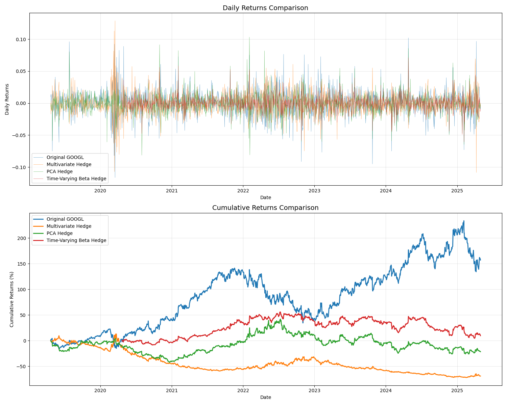

## Waymo Pure Play

Based on [this](https://x.com/JaredKubin/status/1928636508107342124) tweet from Jared L Kubin I was interested in implementing a hedging strategy to be only long waymo by removing exposure to Google's other businesses (advertising, cloud, youtube). The core idea is that Google trades at a conglomerate discount where Waymo (which is a tiny fraction of the revenue) represents significant value but is obscured by the other parts of Google's business.

There are three hedging approaches applied:
1. Multivariate linear regression:
2. PCA
3. Time-Varying Beta Hedge

### 1 - Multivariate Linear Regression

This approach models Google's returns as a linear combination of advertising and tech sector proxies.

$R_{GOOGL,t}=\alpha+\beta_1 R_{META,t} + \beta_2 R_{XLC,t} + \beta_3 R_{AMZN,t} + \beta_4 R_{NFLX,t} + \beta_5 R_{QQQ,t} + \varepsilon_t$

The primary method of this method is the interpretability since each hedge ratio directly corresponds to a different business exposure that needs to be removed. The main drawback is the assumption of linearity between Google and the factor exposures which may break down.

### 2 - PCA Hedge

### 3 - Time-Varying Beta Hedge

This approach uses a rolling window approach, the hedge ratio adapts to recent correlation patterns rather than assuming constant relationships.

For each time series $t$, using a window of $w=252$

$\beta_t = \frac{\text{Cov}(R_{GOOGL}, R_{hedge}){t-w:t}}{\text{Var}(R{hedge})_{t-w:t}}$

$\text{hedge_ratio}_t = -\beta_t$

$R_{hedged,t} = R_{GOOGL,t} + \text{hedge_ratio}t \times R_{hedge,t}$

The time-varying approach adapts to changing market conditions and can capture structural breaks in the relationship between Google and its sector exposures. This flexibility comes at the cost of increased model complexity and higher transaction costs due to more frequent rebalancing requirements.

### Conculsion

