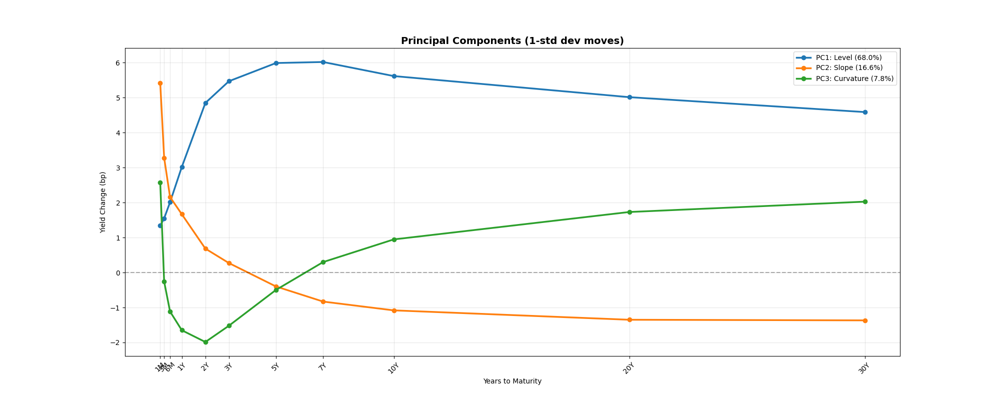

# Yield Curve PCA Decomposition

This strategy is based on the Solomon Smith Barney paper titled Principles of Principal Components that decomposes the yield curve into level, slope, and curvature. This decomposition can be then used in the following ways:

- Risk management.
- Return attribution.
- Butterfly relative value trades.

### Outline

### Improvements

Of course the main improvement that could be achieved is implementing either a hedging strategy or a butterfly trade strategy. But due to my lack of good data, I would have to take countless assumptions (repo, carry, roll, etc.) that whatever results I would get for my backtest would be very far off the true values. Hence the choice to focus on the PCA part and not go further. 